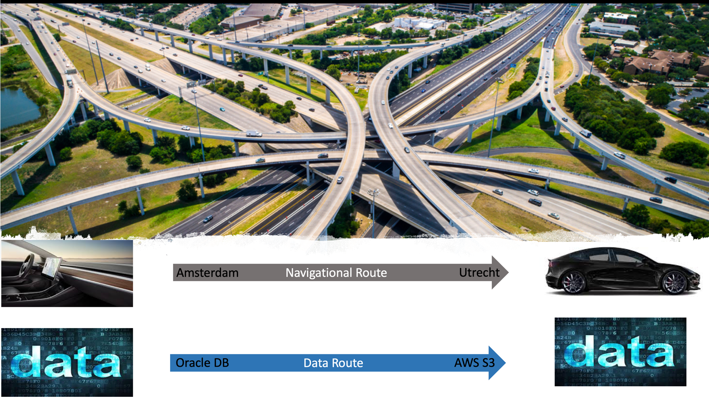
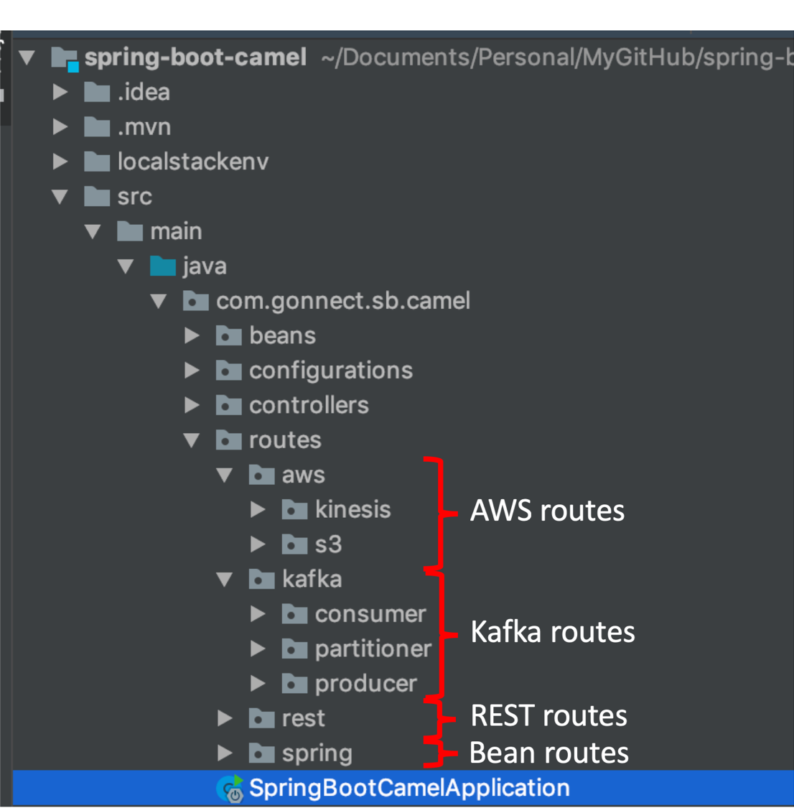

# Router Pattern In Data/Software Engineering

What is common between Navigation System & Data Engineering - "_**movement from A to B with location transparency**_". **Location transparency** means that "A" is unaware of "B". A navigation system handles "location transparency" by defining "routes" i.e. how to go from "A" to "B" by picking up the correct highway and as a driver "_I don't want to know how_"

Can we apply same principle to "Data Engineering". The answer is  "Yes". Location transparency is achieved by implementation of "**Router Pattern**". _The Router pattern has been recognized as an excellent way to accomplish Enterprise Application Integration (EAI)._ A router is a component  that connects its consumer  to one of multiple output strategies (as enunciated in the strategy design pattern). This pattern is also one of the most powerful design pattern for the "micro-services architecture" as it can transform an application that is monolithic, non modular, non configurable among other bad things into a thing of beauty/piece of art. 



Check out my Github project which shows:
1. Moving data to "Data Lake - AWS S3"
2. Moving data to "Data Pipeline - AWS Kinesis & Apache Kafka"
3. Moving API data to "Data Pipeline - AWS Kinesis" 

It also demonstrates opinionated way of AWS based development without AWS account  but the same software will run on AWS cloud with "no fuss".

## EIA Patterns demonstrated

Following EIA are implemented using Spring Boot & Apache Camel:
1. Route to Spring bean
2. Route to AWS S3
3. Route to AWS Kinesis from REST end point
4. Route to Apache Kafka



Let's checkout one of routes which moved REST API data to AWS Kinesis:
```java_holder_method_tree
  restConfiguration().host("localhost").port(4001);

        from("timer:hi?period={{timer.period}}")
                .setHeader("id", simple("${random(1,3)}"))
                .to("rest:get:cars/{id}")
                .log("[going to Kinesis]"+"${body}")
                .setHeader(KinesisConstants.PARTITION_KEY,simple("1"))
                .setHeader(KinesisConstants.SHARD_ID, simple("1"))
                .to("aws-kinesis://mykinesisstream?amazonKinesisClient=#amazonKinesisClient")
                .to("log:out?showAll=true")
                .log("Completed Writing to Kinesis");
```
To run this project you can setup/emulate AWS locally on you laptop by following below steps. It also comes with docker image of Apache Kafka + Zookeeper

### Step 1: Create *python* virtual environment
```bash
python3 -m virtualenv localstackenv
```

### Step 2: Activate virtual environment
```bash
source localstackenv/bin/activate   
```

### Step 3: Install AWS Local stack
```bash
pip install localstack    
```
### Step4: Start localstack

```bash
localstack start --docker
```

### Step 4: Start kafka with zookeeper
```bash
docker-compose up
```


## Play time
Just run the Spring Boot application - "**SpringBootCamelApplication**" from IDE or maven & observe the logs.
```bash
04-05 22:28:08.085  INFO 15227 --- [timer://trigger] RandomTextGeneratorRoute                 : Completed uploading to s3 bucket
2019-04-05 22:28:08.142  INFO 15227 --- [#2 - timer://hi] out                                      : Exchange[Id: ID-APMGJGH67551C6-1554496083321-0-3, ExchangePattern: InOnly, Properties: {CamelCharsetName=UTF-8, CamelCreatedTimestamp=Fri Apr 05 22:28:07 CEST 2019, CamelExternalRedelivered=false, CamelMessageHistory=[DefaultMessageHistory[routeId=route1, node=setHeader1], DefaultMessageHistory[routeId=route1, node=to1], DefaultMessageHistory[routeId=route1, node=log1], DefaultMessageHistory[routeId=route1, node=setHeader2], DefaultMessageHistory[routeId=route1, node=setHeader3], DefaultMessageHistory[routeId=route1, node=to2], DefaultMessageHistory[routeId=route1, node=to3]], CamelTimerCounter=1, CamelTimerFiredTime=Fri Apr 05 22:28:07 CEST 2019, CamelTimerName=hi, CamelTimerPeriod=2000, CamelToEndpoint=log://out?showAll=true}, Headers: {breadcrumbId=ID-APMGJGH67551C6-1554496083321-0-3, CamelAwsKinesisPartitionKey=1, CamelAwsKinesisSequenceNumber=49594520045010805967108657697625239938944816053437333506, CamelAwsKinesisShardId=shardId-000000000000, CamelHttpMethod=GET, CamelHttpResponseCode=200, CamelHttpResponseText=, Content-Type=application/json;charset=UTF-8, Date=Fri, 05 Apr 2019 20:28:08 GMT, firedTime=Fri Apr 05 22:28:07 CEST 2019, id=1, Transfer-Encoding=chunked}, BodyType: org.apache.camel.converter.stream.CachedOutputStream.WrappedInputStream, Body: [Body is instance of java.io.InputStream], Out: null: ]
2019-04-05 22:28:08.142  INFO 15227 --- [#2 - timer://hi] route1                                   : Completed Writing to Kinesis
2019-04-05 22:28:08.503  INFO 15227 --- [ucer[TestTopic]] kafkaStartWithPartitioner                : publish message to kafka
2019-04-05 22:28:08.503  INFO 15227 --- [ucer[TestTopic]] kafkaStartWithPartitioner                : Hello from Gonnect
2019-04-05 22:28:09.245  INFO 15227 --- [umer[TestTopic]] o.a.k.c.c.internals.AbstractCoordinator  : [Consumer clientId=consumer-1, groupId=kafkaGroup] Discovered group coordinator 127.0.0.1:9092 (id: 2147482646 rack: null)
2019-04-05 22:28:09.247  INFO 15227 --- [umer[TestTopic]] o.a.k.c.c.internals.ConsumerCoordinator  : [Consumer clientId=consumer-1, groupId=kafkaGroup] Revoking previously assigned partitions []
2019-04-05 22:28:09.247  INFO 15227 --- [umer[TestTopic]] o.a.k.c.c.internals.AbstractCoordinator  : [Consumer clientId=consumer-1, groupId=kafkaGroup] (Re-)joining group
2019-04-05 22:28:09.331  INFO 15227 --- [- timer://hello] route2                                   : {"name":"TESLA"}
2019-04-05 22:28:09.331  INFO 15227 --- [#2 - timer://hi] route1                                   : [going to Kinesis]{"name":"BMW"}
2019-04-05 22:28:09.333  INFO 15227 --- [ucer[TestTopic]] kafkaStartWithPartitioner                : publish message to kafka
2019-04-05 22:28:09.334  INFO 15227 --- [ucer[TestTopic]] kafkaStartWithPartitioner                : Hello from Gonnect
2019-04-05 22:28:09.354  INFO 15227 --- [#2 - timer://hi] out                                      : Exchange[Id: ID-APMGJGH67551C6-1554496083321-0-11, ExchangePattern: InOnly, Properties: {CamelCharsetName=UTF-8, CamelCreatedTimestamp=Fri Apr 05 22:28:09 CEST 2019, CamelExternalRedelivered=false, CamelMessageHistory=[DefaultMessageHistory[routeId=route1, node=setHeader1], DefaultMessageHistory[routeId=route1, node=to1], DefaultMessageHistory[routeId=route1, node=log1], DefaultMessageHistory[routeId=route1, node=setHeader2], DefaultMessageHistory[routeId=route1, node=setHeader3], DefaultMessageHistory[routeId=route1, node=to2], DefaultMessageHistory[routeId=route1, node=to3]], CamelTimerCounter=2, CamelTimerFiredTime=Fri Apr 05 22:28:09 CEST 2019, CamelTimerName=hi, CamelTimerPeriod=2000, CamelToEndpoint=log://out?showAll=true}, Headers: {breadcrumbId=ID-APMGJGH67551C6-1554496083321-0-11, CamelAwsKinesisPartitionKey=1, CamelAwsKinesisSequenceNumber=49594520045010805967108657697626448864764430751331516418, CamelAwsKinesisShardId=shardId-000000000000, CamelHttpMethod=GET, CamelHttpResponseCode=200, CamelHttpResponseText=, Content-Type=application/json;charset=UTF-8, Date=Fri, 05 Apr 2019 20:28:09 GMT, firedTime=Fri Apr 05 22:28:09 CEST 2019, id=1, Transfer-Encoding=chunked}, BodyType: org.apache.camel.converter.stream.CachedOutputStream.WrappedInputStream, Body: [Body is instance of java.io.InputStream], Out: null: ]
2019-04-05 22:28:09.354  INFO 15227 --- [#2 - timer://hi] route1                                   : Completed Writing to Kinesis
2019-04-05 22:28:09.377  INFO 15227 --- [umer[TestTopic]] o.a.k.c.c.internals.AbstractCoordinator  : [Consumer clientId=consumer-1, groupId=kafkaGroup] Successfully joined group with generation 1
2019-04-05 22:28:09.379  INFO 15227 --- [umer[TestTopic]] o.a.k.c.c.internals.ConsumerCoordinator  : [Consumer clientId=consumer-1, groupId=kafkaGroup] Setting newly assigned partitions [TestTopic-0]
2019-04-05 22:28:09.401  INFO 15227 --- [umer[TestTopic]] o.a.k.c.consumer.internals.Fetcher       : [Consumer clientId=consumer-1, groupId=kafkaGroup] Resetting offset for partition TestTopic-0 to offset 2.
2019-04-05 22:28:09.963  INFO 15227 --- [umer[TestTopic]] o.a.k.c.consumer.internals.Fetcher       : [Consumer clientId=consumer-1, groupId=kafkaGroup] Resetting offset for partition TestTopic-0 to offset 0.
2019-04-05 22:28:09.982  INFO 15227 --- [umer[TestTopic]] FromKafka                                : consumed message from Kafka
2019-04-05 22:28:09.982  INFO 15227 --- [umer[TestTopic]] FromKafka                                : Hello from Gonnect
2019-04-05 22:28:09.982  INFO 15227 --- [umer[TestTopic]] FromKafka                                : consumed message from Kafka
2019-04-05 22:28:09.982  INFO 15227 --- [umer[TestTopic]] FromKafka                                : Hello from Gonnect
Hello from Gonnect
2019-04-05 22:28:11.326  INFO 15227 --- [#2 - timer://hi] route1                                   : [going to Kinesis]{"name":"BMW"}
2019-04-05 22:28:11.332  INFO 15227 --- [- timer://hello] route2                                   : {"name":"TESLA"}
2019-04-05 22:28:11.339  INFO 15227 --- [umer[TestTopic]] FromKafka                                : consumed message from Kafka
2019-04-05 22:28:11.339  INFO 15227 --- [umer[TestTopic]] FromKafka                                : Hello from Gonnect
2019-04-05 22:28:11.340  INFO 15227 --- [ucer[TestTopic]] kafkaStartWithPartitioner                : publish message to kafka
2019-04-05 22:28:11.341  INFO 15227 --- [ucer[TestTopic]] kafkaStartWithPartitioner                : Hello from Gonnect
2019-04-05 22:28:11.376  INFO 15227 --- [#2 - timer://hi] out                                      : Exchange[Id: ID-APMGJGH67551C6-1554496083321-0-17, ExchangePattern: InOnly, Properties: {CamelCharsetName=UTF-8, CamelCreatedTimestamp=Fri Apr 05 22:28:11 CEST 2019, CamelExternalRedelivered=false, CamelMessageHistory=[DefaultMessageHistory[routeId=route1, node=setHeader1], DefaultMessageHistory[routeId=route1, node=to1], DefaultMessageHistory[routeId=route1, node=log1], DefaultMessageHistory[routeId=route1, node=setHeader2], DefaultMessageHistory[routeId=route1, node=setHeader3], DefaultMessageHistory[routeId=route1, node=to2], DefaultMessageHistory[routeId=route1, node=to3]], CamelTimerCounter=3, CamelTimerFiredTime=Fri Apr 05 22:28:11 CEST 2019, CamelTimerName=hi, CamelTimerPeriod=2000, CamelToEndpoint=log://out?showAll=true}, Headers: {breadcrumbId=ID-APMGJGH67551C6-1554496083321-0-17, CamelAwsKinesisPartitionKey=1, CamelAwsKinesisSequenceNumber=49594520045010805967108657697627657790584045517945176066, CamelAwsKinesisShardId=shardId-000000000000, CamelHttpMethod=GET, CamelHttpResponseCode=200, CamelHttpResponseText=, Content-Type=application/json;charset=UTF-8, Date=Fri, 05 Apr 2019 20:28:11 GMT, firedTime=Fri Apr 05 22:28:11 CEST 2019, id=1, Transfer-Encoding=chunked}, BodyType: org.apache.camel.converter.stream.CachedOutputStream.WrappedInputStream, Body: [Body is instance of java.io.InputStream], Out: null: ]
2019-04-05 22:28:11.376  INFO 15227 --- [#2 - timer://hi] route1                                   : Completed Writing to Kinesis
Hello from Gonnect
2019-04-05 22:28:13.326  INFO 15227 --- [#2 - timer://hi] route1                                   : [going to Kinesis]{"name":"TESLA"}
2019-04-05 22:28:13.330  INFO 15227 --- [ucer[TestTopic]] kafkaStartWithPartitioner                : publish message to kafka
2019-04-05 22:28:13.330  INFO 15227 --- [ucer[TestTopic]] kafkaStartWithPartitioner                : Hello from Gonnect
2019-04-05 22:28:13.331  INFO 15227 --- [umer[TestTopic]] FromKafka                                : consumed message from Kafka
2019-04-05 22:28:13.331  INFO 15227 --- [umer[TestTopic]] FromKafka                                : Hello from Gonnect
2019-04-05 22:28:13.333  INFO 15227 --- [- timer://hello] route2                                   : {"name":"TESLA"}
2019-04-05 22:28:13.338  INFO 15227 --- [#2 - timer://hi] out                                      : Exchange[Id: ID-APMGJGH67551C6-1554496083321-0-24, ExchangePattern: InOnly, Properties: {CamelCharsetName=UTF-8, CamelCreatedTimestamp=Fri Apr 05 22:28:13 CEST 2019, CamelExternalRedelivered=false, CamelMessageHistory=[DefaultMessageHistory[routeId=route1, node=setHeader1], DefaultMessageHistory[routeId=route1, node=to1], DefaultMessageHistory[routeId=route1, node=log1], DefaultMessageHistory[routeId=route1, node=setHeader2], DefaultMessageHistory[routeId=route1, node=setHeader3], DefaultMessageHistory[routeId=route1, node=to2], DefaultMessageHistory[routeId=route1, node=to3]], CamelTimerCounter=4, CamelTimerFiredTime=Fri Apr 05 22:28:13 CEST 2019, CamelTimerName=hi, CamelTimerPeriod=2000, CamelToEndpoint=log://out?showAll=true}, Headers: {breadcrumbId=ID-APMGJGH67551C6-1554496083321-0-24, CamelAwsKinesisPartitionKey=1, CamelAwsKinesisSequenceNumber=49594520045010805967108657697628866716403660284558835714, CamelAwsKinesisShardId=shardId-000000000000, CamelHttpMethod=GET, CamelHttpResponseCode=200, CamelHttpResponseText=, Content-Type=application/json;charset=UTF-8, Date=Fri, 05 Apr 2019 20:28:13 GMT, firedTime=Fri Apr 05 22:28:13 CEST 2019, id=2, Transfer-Encoding=chunked}, BodyType: org.apache.camel.converter.stream.CachedOutputStream.WrappedInputStream, Body: [Body is instance of java.io.InputStream], Out: null: ]
2019-04-05 22:28:13.338  INFO 15227 --- [#2 - timer://hi] route1                                   : Completed Writing to Kinesis
Hello from Gonnect
2019-04-05 22:28:15.329  INFO 15227 --- [#2 - timer://hi] route1                                   : [going to Kinesis]{"name":"BMW"}
2019-04-05 22:28:15.331  INFO 15227 --- [ucer[TestTopic]] kafkaStartWithPartitioner                : publish message to kafka
2019-04-05 22:28:15.331  INFO 15227 --- [ucer[TestTopic]] kafkaStartWithPartitioner                : Hello from Gonnect
2019-04-05 22:28:15.331  INFO 15227 --- [umer[TestTopic]] FromKafka                                : consumed message from Kafka
2019-04-05 22:28:15.333  INFO 15227 --- [umer[TestTopic]] FromKafka                                : Hello from Gonnect
2019-04-05 22:28:15.335  INFO 15227 --- [- timer://hello] route2                                   : {"name":"BMW"}
2019-04-05 22:28:15.337  INFO 15227 --- [#2 - timer://hi] out                                      : Exchange[Id: ID-APMGJGH67551C6-1554496083321-0-31, ExchangePattern: InOnly, Properties: {CamelCharsetName=UTF-8, CamelCreatedTimestamp=Fri Apr 05 22:28:15 CEST 2019, CamelExternalRedelivered=false, CamelMessageHistory=[DefaultMessageHistory[routeId=route1, node=setHeader1], DefaultMessageHistory[routeId=route1, node=to1], DefaultMessageHistory[routeId=route1, node=log1], DefaultMessageHistory[routeId=route1, node=setHeader2], DefaultMessageHistory[routeId=route1, node=setHeader3], DefaultMessageHistory[routeId=route1, node=to2], DefaultMessageHistory[routeId=route1, node=to3]], CamelTimerCounter=5, CamelTimerFiredTime=Fri Apr 05 22:28:15 CEST 2019, CamelTimerName=hi, CamelTimerPeriod=2000, CamelToEndpoint=log://out?showAll=true}, Headers: {breadcrumbId=ID-APMGJGH67551C6-1554496083321-0-31, CamelAwsKinesisPartitionKey=1, CamelAwsKinesisSequenceNumber=49594520045010805967108657697630075642223275051172495362, CamelAwsKinesisShardId=shardId-000000000000, CamelHttpMethod=GET, CamelHttpResponseCode=200, CamelHttpResponseText=, Content-Type=application/json;charset=UTF-8, Date=Fri, 05 Apr 2019 20:28:15 GMT, firedTime=Fri Apr 05 22:28:15 CEST 2019, id=1, Transfer-Encoding=chunked}, BodyType: org.apache.camel.converter.stream.CachedOutputStream.WrappedInputStream, Body: [Body is instance of java.io.InputStream], Out: null: ]
2019-04-05 22:28:15.337  INFO 15227 --- [#2 - timer://hi] route1                                   : Completed Writing to Kinesis
Hello from Gonnect
2019-04-05 22:28:17.333  INFO 15227 --- [ucer[TestTopic]] kafkaStartWithPartitioner                : publish message to kafka
2019-04-05 22:28:17.333  INFO 15227 --- [ucer[TestTopic]] kafkaStartWithPartitioner                : Hello from Gonnect
2019-04-05 22:28:17.333  INFO 15227 --- [#2 - timer://hi] route1                                   : [going to Kinesis]{"name":"TESLA"}
2019-04-05 22:28:17.333  INFO 15227 --- [umer[TestTopic]] FromKafka                                : consumed message from Kafka
2019-04-05 22:28:17.334  INFO 15227 --- [umer[TestTopic]] FromKafka                                : Hello from Gonnect
2019-04-05 22:28:17.337  INFO 15227 --- [- timer://hello] route2                                   : {"name":"BMW"}
2019-04-05 22:28:17.345  INFO 15227 --- [#2 - timer://hi] out                                      : Exchange[Id: ID-APMGJGH67551C6-1554496083321-0-40, ExchangePattern: InOnly, Properties: {CamelCharsetName=UTF-8, CamelCreatedTimestamp=Fri Apr 05 22:28:17 CEST 2019, CamelExternalRedelivered=false, CamelMessageHistory=[DefaultMessageHistory[routeId=route1, node=setHeader1], DefaultMessageHistory[routeId=route1, node=to1], DefaultMessageHistory[routeId=route1, node=log1], DefaultMessageHistory[routeId=route1, node=setHeader2], DefaultMessageHistory[routeId=route1, node=setHeader3], DefaultMessageHistory[routeId=route1, node=to2], DefaultMessageHistory[routeId=route1, node=to3]], CamelTimerCounter=6, CamelTimerFiredTime=Fri Apr 05 22:28:17 CEST 2019, CamelTimerName=hi, CamelTimerPeriod=2000, CamelToEndpoint=log://out?showAll=true}, Headers: {breadcrumbId=ID-APMGJGH67551C6-1554496083321-0-40, CamelAwsKinesisPartitionKey=1, CamelAwsKinesisSequenceNumber=49594520045010805967108657697631284568042889817786155010, CamelAwsKinesisShardId=shardId-000000000000, CamelHttpMethod=GET, CamelHttpResponseCode=200, CamelHttpResponseText=, Content-Type=application/json;charset=UTF-8, Date=Fri, 05 Apr 2019 20:28:17 GMT, firedTime=Fri Apr 05 22:28:17 CEST 2019, id=2, Transfer-Encoding=chunked}, BodyType: org.apache.camel.converter.stream.CachedOutputStream.WrappedInputStream, Body: [Body is instance of java.io.InputStream], Out: null: ]
2019-04-05 22:28:17.345  INFO 15227 --- [#2 - timer://hi] route1                                   : Completed Writing to Kinesis
Hello from Gonnect
2019-04-05 22:28:19.333  INFO 15227 --- [#2 - timer://hi] route1                                   : [going to Kinesis]{"name":"BMW"}
2019-04-05 22:28:19.335  INFO 15227 --- [- timer://hello] route2                                   : {"name":"TESLA"}
2019-04-05 22:28:19.336  INFO 15227 --- [ucer[TestTopic]] kafkaStartWithPartitioner                : publish message to kafka
2019-04-05 22:28:19.336  INFO 15227 --- [ucer[TestTopic]] kafkaStartWithPartitioner                : Hello from Gonnect
2019-04-05 22:28:19.336  INFO 15227 --- [umer[TestTopic]] FromKafka                                : consumed message from Kafka
2019-04-05 22:28:19.336  INFO 15227 --- [umer[TestTopic]] FromKafka                                : Hello from Gonnect
2019-04-05 22:28:19.342  INFO 15227 --- [#2 - timer://hi] out                                      : Exchange[Id: ID-APMGJGH67551C6-1554496083321-0-45, ExchangePattern: InOnly, Properties: {CamelCharsetName=UTF-8, CamelCreatedTimestamp=Fri Apr 05 22:28:19 CEST 2019, CamelExternalRedelivered=false, CamelMessageHistory=[DefaultMessageHistory[routeId=route1, node=setHeader1], DefaultMessageHistory[routeId=route1, node=to1], DefaultMessageHistory[routeId=route1, node=log1], DefaultMessageHistory[routeId=route1, node=setHeader2], DefaultMessageHistory[routeId=route1, node=setHeader3], DefaultMessageHistory[routeId=route1, node=to2], DefaultMessageHistory[routeId=route1, node=to3]], CamelTimerCounter=7, CamelTimerFiredTime=Fri Apr 05 22:28:19 CEST 2019, CamelTimerName=hi, CamelTimerPeriod=2000, CamelToEndpoint=log://out?showAll=true}, Headers: {breadcrumbId=ID-APMGJGH67551C6-1554496083321-0-45, CamelAwsKinesisPartitionKey=1, CamelAwsKinesisSequenceNumber=49594520045010805967108657697632493493862504584399814658, CamelAwsKinesisShardId=shardId-000000000000, CamelHttpMethod=GET, CamelHttpResponseCode=200, CamelHttpResponseText=, Content-Type=application/json;charset=UTF-8, Date=Fri, 05 Apr 2019 20:28:19 GMT, firedTime=Fri Apr 05 22:28:19 CEST 2019, id=1, Transfer-Encoding=chunked}, BodyType: org.apache.camel.converter.stream.CachedOutputStream.WrappedInputStream, Body: [Body is instance of java.io.InputStream], Out: null: ]
2019-04-05 22:28:19.343  INFO 15227 --- [#2 - timer://hi] route1                                   : Completed Writing to Kinesis
Hello from Gonnect
2019-04-05 22:28:21.333  INFO 15227 --- [#2 - timer://hi] route1                                   : [going to Kinesis]{"name":"TESLA"}
2019-04-05 22:28:21.337  INFO 15227 --- [- timer://hello] route2                                   : {"name":"TESLA"}
2019-04-05 22:28:21.338  INFO 15227 --- [ucer[TestTopic]] kafkaStartWithPartitioner                : publish message to kafka
2019-04-05 22:28:21.338  INFO 15227 --- [umer[TestTopic]] FromKafka                                : consumed message from Kafka
2019-04-05 22:28:21.338  INFO 15227 --- [ucer[TestTopic]] kafkaStartWithPartitioner                : Hello from Gonnect
2019-04-05 22:28:21.338  INFO 15227 --- [umer[TestTopic]] FromKafka                                : Hello from Gonnect
2019-04-05 22:28:21.342  INFO 15227 --- [#2 - timer://hi] out                                      : Exchange[Id: ID-APMGJGH67551C6-1554496083321-0-52, ExchangePattern: InOnly, Properties: {CamelCharsetName=UTF-8, CamelCreatedTimestamp=Fri Apr 05 22:28:21 CEST 2019, CamelExternalRedelivered=false, CamelMessageHistory=[DefaultMessageHistory[routeId=route1, node=setHeader1], DefaultMessageHistory[routeId=route1, node=to1], DefaultMessageHistory[routeId=route1, node=log1], DefaultMessageHistory[routeId=route1, node=setHeader2], DefaultMessageHistory[routeId=route1, node=setHeader3], DefaultMessageHistory[routeId=route1, node=to2], DefaultMessageHistory[routeId=route1, node=to3]], CamelTimerCounter=8, CamelTimerFiredTime=Fri Apr 05 22:28:21 CEST 2019, CamelTimerName=hi, CamelTimerPeriod=2000, CamelToEndpoint=log://out?showAll=true}, Headers: {breadcrumbId=ID-APMGJGH67551C6-1554496083321-0-52, CamelAwsKinesisPartitionKey=1, CamelAwsKinesisSequenceNumber=49594520045010805967108657697633702419682119351013474306, CamelAwsKinesisShardId=shardId-000000000000, CamelHttpMethod=GET, CamelHttpResponseCode=200, CamelHttpResponseText=, Content-Type=application/json;charset=UTF-8, Date=Fri, 05 Apr 2019 20:28:21 GMT, firedTime=Fri Apr 05 22:28:21 CEST 2019, id=2, Transfer-Encoding=chunked}, BodyType: org.apache.camel.converter.stream.CachedOutputStream.WrappedInputStream, Body: [Body is instance of java.io.InputStream], Out: null: ]
2019-04-05 22:28:21.343  INFO 15227 --- [#2 - timer://hi] route1                                   : Completed Writing to Kinesis
Hello from Gonnect
2019-04-05 22:28:23.334  INFO 15227 --- [#2 - timer://hi] route1                                   : [going to Kinesis]{"name":"BMW"}
2019-04-05 22:28:23.335  INFO 15227 --- [ucer[TestTopic]] kafkaStartWithPartitioner                : publish message to kafka
2019-04-05 22:28:23.335  INFO 15227 --- [umer[TestTopic]] FromKafka                                : consumed message from Kafka
2019-04-05 22:28:23.335  INFO 15227 --- [ucer[TestTopic]] kafkaStartWithPartitioner                : Hello from Gonnect
2019-04-05 22:28:23.335  INFO 15227 --- [umer[TestTopic]] FromKafka                                : Hello from Gonnect
2019-04-05 22:28:23.337  INFO 15227 --- [- timer://hello] route2                                   : {"name":"TESLA"}
2019-04-05 22:28:23.353  INFO 15227 --- [#2 - timer://hi] out                                      : Exchange[Id: ID-APMGJGH67551C6-1554496083321-0-61, ExchangePattern: InOnly, Properties: {CamelCharsetName=UTF-8, CamelCreatedTimestamp=Fri Apr 05 22:28:23 CEST 2019, CamelExternalRedelivered=false, CamelMessageHistory=[DefaultMessageHistory[routeId=route1, node=setHeader1], DefaultMessageHistory[routeId=route1, node=to1], DefaultMessageHistory[routeId=route1, node=log1], DefaultMessageHistory[routeId=route1, node=setHeader2], DefaultMessageHistory[routeId=route1, node=setHeader3], DefaultMessageHistory[routeId=route1, node=to2], DefaultMessageHistory[routeId=route1, node=to3]], CamelTimerCounter=9, CamelTimerFiredTime=Fri Apr 05 22:28:23 CEST 2019, CamelTimerName=hi, CamelTimerPeriod=2000, CamelToEndpoint=log://out?showAll=true}, Headers: {breadcrumbId=ID-APMGJGH67551C6-1554496083321-0-61, CamelAwsKinesisPartitionKey=1, CamelAwsKinesisSequenceNumber=49594520045010805967108657697634911345501734117627133954, CamelAwsKinesisShardId=shardId-000000000000, CamelHttpMethod=GET, CamelHttpResponseCode=200, CamelHttpResponseText=, Content-Type=application/json;charset=UTF-8, Date=Fri, 05 Apr 2019 20:28:23 GMT, firedTime=Fri Apr 05 22:28:23 CEST 2019, id=1, Transfer-Encoding=chunked}, BodyType: org.apache.camel.converter.stream.CachedOutputStream.WrappedInputStream, Body: [Body is instance of java.io.InputStream], Out: null: ]
2019-04-05 22:28:23.353  INFO 15227 --- [#2 - timer://hi] route1                                   : Completed Writing to Kinesis
Hello from Gonnect
```

### Route Information

```bash
curl -XGET -s http://localhost:4001/actuator/camelroutes
```
```json
[
  {
    "id": "route1",
    "uptime": "9.780 seconds",
    "uptimeMillis": 9781,
    "properties": {
      "parent": "64beb2b7",
      "rest": "false",
      "description": null,
      "id": "route1"
    },
    "status": "Started"
  },
  {
    "id": "RandomTextGeneratorRoute",
    "uptime": "9.780 seconds",
    "uptimeMillis": 9780,
    "properties": {
      "parent": "4e4b7abd",
      "rest": "false",
      "description": null,
      "id": "RandomTextGeneratorRoute"
    },
    "status": "Started"
  },
  {
    "id": "FromKafka",
    "uptime": "9.736 seconds",
    "uptimeMillis": 9736,
    "properties": {
      "parent": "730cd2d0",
      "rest": "false",
      "description": null,
      "id": "FromKafka"
    },
    "status": "Started"
  },
  {
    "id": "kafkaStartWithPartitioner",
    "group": "kafka-route-group",
    "uptime": "9.735 seconds",
    "uptimeMillis": 9735,
    "properties": {
      "parent": "f10d3e4",
      "rest": "false",
      "description": null,
      "id": "kafkaStartWithPartitioner",
      "group": "kafka-route-group"
    },
    "status": "Started"
  },
  {
    "id": "route2",
    "uptime": "9.734 seconds",
    "uptimeMillis": 9734,
    "properties": {
      "parent": "38e4f7b",
      "rest": "false",
      "description": null,
      "id": "route2"
    },
    "status": "Started"
  },
  {
    "id": "hello",
    "group": "hello-group",
    "uptime": "9.734 seconds",
    "uptimeMillis": 9734,
    "properties": {
      "parent": "1915ce41",
      "rest": "false",
      "description": null,
      "id": "hello",
      "group": "hello-group"
    },
    "status": "Started"
  }
]
```

```bash
curl -XGET -s http://localhost:4001/actuator/camelroutes/{id}/detail
```

```json
{
  "id": "route1",
  "uptime": "2 minutes",
  "uptimeMillis": 164554,
  "properties": {
    "parent": "64beb2b7",
    "rest": "false",
    "description": null,
    "id": "route1"
  },
  "status": "Started",
  "details": {
    "deltaProcessingTime": -4,
    "exchangesInflight": 0,
    "exchangesTotal": 82,
    "externalRedeliveries": 0,
    "failuresHandled": 0,
    "firstExchangeCompletedExchangeId": "ID-APMGJGH67551C6-1554502425015-0-3",
    "firstExchangeCompletedTimestamp": "2019-04-05T22:13:49.139+0000",
    "lastExchangeCompletedExchangeId": "ID-APMGJGH67551C6-1554502425015-0-590",
    "lastExchangeCompletedTimestamp": "2019-04-05T22:16:30.879+0000",
    "lastProcessingTime": 10,
    "maxProcessingTime": 408,
    "meanProcessingTime": 21,
    "minProcessingTime": 8,
    "redeliveries": 0,
    "totalProcessingTime": 1769,
    "hasRouteController": false
  }
}
```